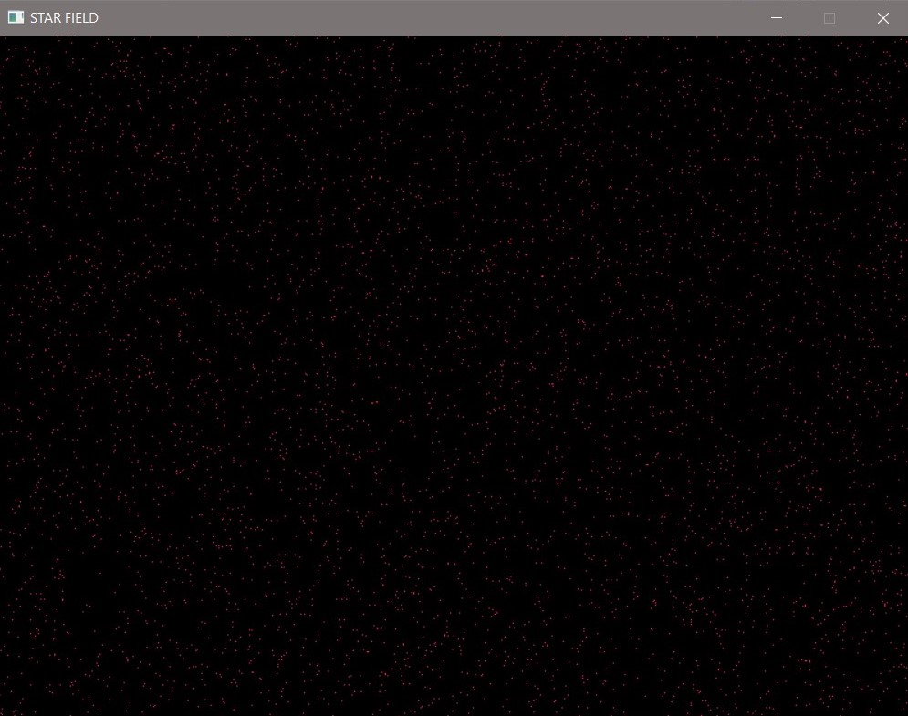
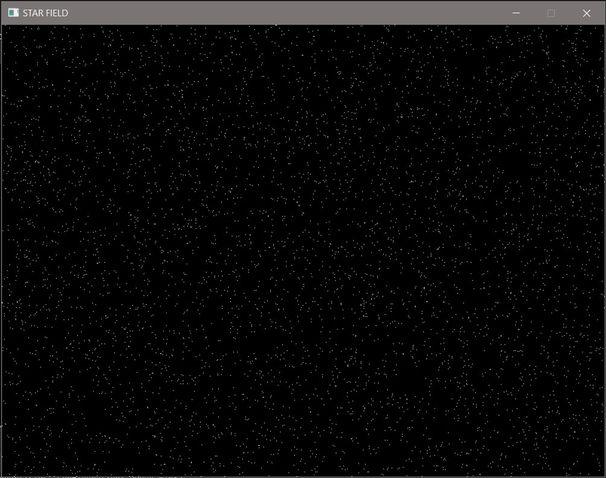

# STAR_FIELD

Program that uses SDL to create a star field which basically contains a lot of particles
positioned randomly across the screen and change colors over time.

**Requirements:**
- Must have SDL2 installed
- C++ 11 or higher

## SCREENSHOT

## Updates:
-Added motion to particles...particles move about randomly but within the window.
